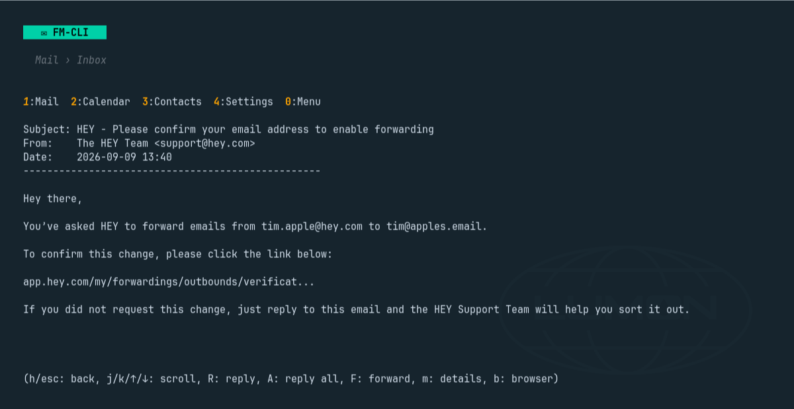

# fm-cli

Fastmail from the terminal: a small Go client for Fastmail's JMAP API with a
full-screen mail app, a set of scriptable commands that print JSON, and a
live `watch` that follows your mailbox over Fastmail's push connection. It is
the engine behind the [Fastmail plugin for Omarchy](https://github.com/ninepointlabs/omarchy-fastmail).



## Install

On Omarchy:

```bash
omarchy-mise-install github:ninepointlabs/fm-cli fm-cli
```

With mise elsewhere:

```bash
mise use -g github:ninepointlabs/fm-cli@latest
```

Every [release](https://github.com/ninepointlabs/fm-cli/releases) also ships
`.pkg.tar.zst`, `.deb` and `.rpm` packages and plain tarballs for Linux and
macOS. From source:

```bash
git clone https://github.com/ninepointlabs/fm-cli.git
cd fm-cli
go build -o fm-cli ./cmd/fm-cli
```

Go 1.25 or newer. No C toolchain needed.

## Sign in

```bash
fm-cli auth login
```

This opens Fastmail's consent page in your browser. Approve fm-cli there and
you are done: the tokens go into your system keyring and refresh themselves.
No token to copy. Fastmail lists the authorization under *Settings → Privacy &
Security → Connected apps*, where you can revoke it.

Prefer an API token? Create one under *Settings → Privacy & Security →
Integrations → API Tokens* with the **Email** scope (add **Email submission**
to send), then:

```bash
fm-cli auth login --token     # prompts, or reads the token from stdin
```

Other auth commands:

```bash
fm-cli auth status            # signed in? as whom? (no network call)
fm-cli auth logout            # revoke the authorization and forget it
fm-cli auth token             # print a current bearer token for curl or scripts
fm-cli auth dav               # store an app password for calendar and contacts
fm-cli setup                  # sign in only if signed out
```

Calendar and contacts use CalDAV and CardDAV, which need a Fastmail **app
password** with *Mail, Contacts & Calendars* access; `fm-cli auth dav` stores
it. For headless machines, `FM_API_TOKEN`, `FM_EMAIL` and `FM_APP_PASSWORD` in
the environment stand in for the keyring.

## The terminal app

```bash
fm-cli                                     # the app, on its main menu
fm-cli tui --thread <thread-id>            # the app, opened on a thread
fm-cli tui --thread <thread-id> --remote   # tell a running app to jump there
```

Folders, threads, reading with links you can click, reply, reply all, forward,
compose in `$EDITOR` with contact autocomplete and a choice of sending
identity, drafts, flags, archive, move, delete, search, a seven-day calendar
agenda, contacts, inline images in terminals that can draw them, and an
offline mode that caches mail in SQLite.

### Keys

| Everywhere | |
|---|---|
| `0` `1` `2` `3` `4` | Main menu, Mail, Calendar, Contacts, Settings |
| `j` `k` or arrows | Move |
| `Enter` `l` | Open |
| `h` `Esc` | Back |
| `r` | Refresh |
| `q` | Quit, from the main menu |

| Email list | |
|---|---|
| `u` | Toggle read/unread |
| `f` | Toggle flag |
| `e` | Archive |
| `d` `Backspace` | Delete |
| `c` | Compose |

| Reading | |
|---|---|
| `R` `A` `F` | Reply, reply all, forward |
| `m` | Toggle full headers |
| `b` | Open the HTML in your browser |
| `i` | Load and show the images inline |
| `e` | Edit, for drafts |

| Compose and send | |
|---|---|
| `↑` `↓` `Tab` `Enter` | Pick a contact suggestion; `Tab` also cycles identities |
| `y` `s` `e` `n` | Send, save as draft, edit body, cancel |

Calendar and contacts: `n` new, `e` edit, `d` delete from the detail view.

## Scripting

Every command below takes `--json` and prints exactly one JSON object:
`{"ok": true, "data": …, "summary": "…"}` on success, and on stderr
`{"ok": false, "error": "…", "code": "auth|usage|network|remote|busy"}` on
failure. The full contract, with every field, is in
[docs/omarchy-contract.md](docs/omarchy-contract.md).

```bash
fm-cli account list --json
fm-cli box list --json
fm-cli box view inbox --limit 20 --json       # one posting per thread, newest first
fm-cli box view all --json                     # Inbox plus every unseen thread in every other folder
fm-cli box view all --exclude "Other Services" --exclude Newsletters --json
fm-cli seen <thread-or-email-id> --json
fm-cli unseen <thread-or-email-id> --json
fm-cli watch                                   # a JSON line per change, live
fm-cli watch --box inbox --events new          # only new unread mail in the Inbox
```

**The `all` view** exists because Fastmail rules run on the server, so mail
filed into folders never touches the Inbox. `box view all` merges the newest
Inbox threads with every unseen thread elsewhere, says which folder each came
from, and lists the folders that currently have unread mail. Junk, Trash,
Drafts, Sent, Snoozed, Scheduled and Archive are always left out; `--exclude`
drops more, by name, path, role or id, and a parent folder takes its
subfolders with it.

**`watch`** holds a JMAP push connection open. It prints `{"change":"ready"}`
once it is caught up, one line per added, updated or deleted email with the
folder it sits in and a `new` flag for unseen mail that arrived after the
watch began, `{"change":"disconnected"}` when the connection drops, and
`{"change":"resync"}` when the server could not list changes one by one.
Fastmail allows one push connection per sign-in, so a second `watch` refuses
to start rather than knocking the first offline.

## Security

- **Credentials** live in the system keyring (Secret Service, KWallet,
  Keychain or Windows Credential Manager only; never a file), as one record
  holding the access token, the rotating refresh token and their expiry.
- **OAuth** uses PKCE and a random state, listens on a random loopback port
  for the browser's redirect only, ignores requests that do not carry this
  attempt's state, and sends the RFC 8707 `resource` parameter Fastmail
  requires. Refresh is serialized across processes with a file lock, because
  Fastmail revokes the whole authorization if a spent refresh token is reused.
- **`auth token`** prints a bearer token that reads and changes your mail
  until it expires. It warns on a terminal; keep it out of shell history.
- **Untrusted text**: subjects, senders, previews and bodies have control
  characters stripped before they reach the terminal, list rows are cut by
  character rather than byte, and only URLs made of RFC 3986 characters become
  clickable links.
- **Images and the browser**: `i` loads an email's images over https only, up
  to 8 MB each, and tells the sender's server that you opened the mail; `b`
  opens the HTML in your browser with a Content-Security-Policy that blocks
  scripts and remote loads other than images. Both are yours to press.
- **Local files**: the hand-off socket for `tui --remote`, the watch lock and
  the refresh lock live in `$XDG_RUNTIME_DIR/fm-cli` (mode 700, owner
  checked), cached mail in `~/.config/fm-cli/emails.db` (mode 600), and the
  browser preview in `~/.cache/fm-cli/preview.html`, replaced on each use and
  removed after ten minutes.
- Dependencies are pinned in `go.mod`; `govulncheck ./...` runs clean as of
  0.3.0. Releases are built by GitHub Actions from a tag, with the actions
  pinned to commits.

## Offline mode and settings

```bash
fm-cli settings                 # show settings
fm-cli settings offline on      # cache mail and bodies locally, draft offline
fm-cli sync                     # push queued offline changes
fm-cli debug                    # dump the JMAP session and DAV status
```

Calendar and contacts need a connection; only mail works offline. If you
started offline and want to go online, restart the app.

## Troubleshooting

- **"No calendars found" or "No address books found"**: store an app password
  with `fm-cli auth dav`; the API token alone does not cover CalDAV/CardDAV.
  `fm-cli debug` reports the DAV status.
- **Images not showing inline**: the terminal must support Sixel, the Kitty
  graphics protocol, or iTerm2 images (Kitty, WezTerm, foot, iTerm2, mlterm).
  `b` opens the mail in the browser instead.
- **`another fm-cli watch is already running`**: one push connection per
  sign-in. Stop the other watch, or let it be the one; the Omarchy plugin's
  watch is normally the one.
- **Sign-in says `invalid_target`**: an older fm-cli; 0.3.0 sends the
  `resource` parameter Fastmail requires.

## Development

```bash
go test ./...
go vet ./...
go run golang.org/x/vuln/cmd/govulncheck@latest ./...
```

Releases: push a `v*` tag and GoReleaser builds the packages and tarballs.
`./scripts/build-deb.sh`, `./scripts/build-rpm.sh` and
`packaging/archlinux/PKGBUILD` build the packages locally.

## License

MIT, see [LICENSE](LICENSE). Not affiliated with Fastmail.
